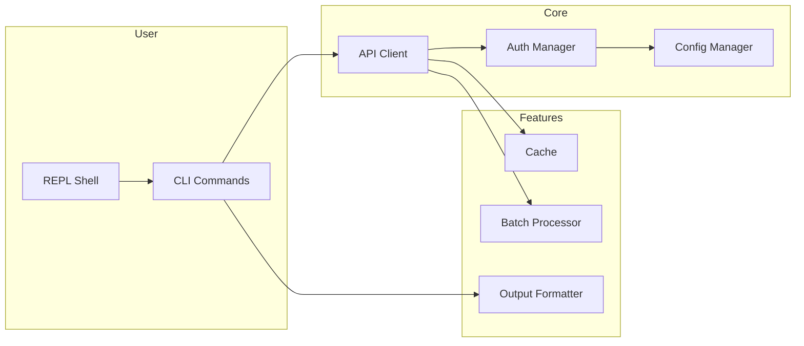
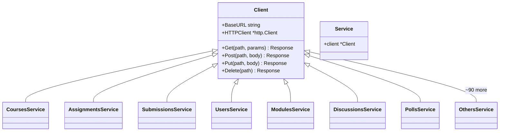
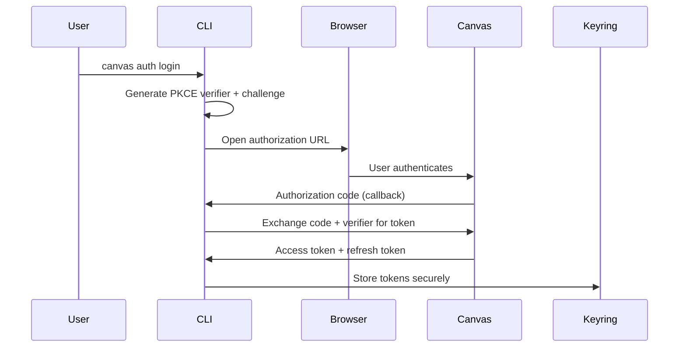
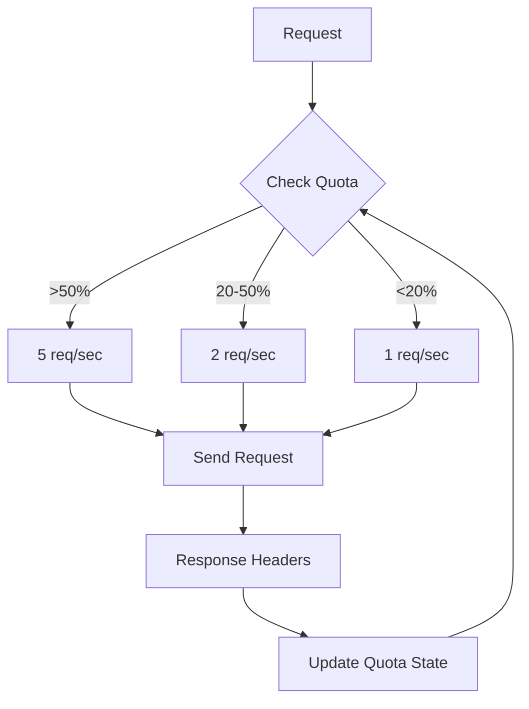
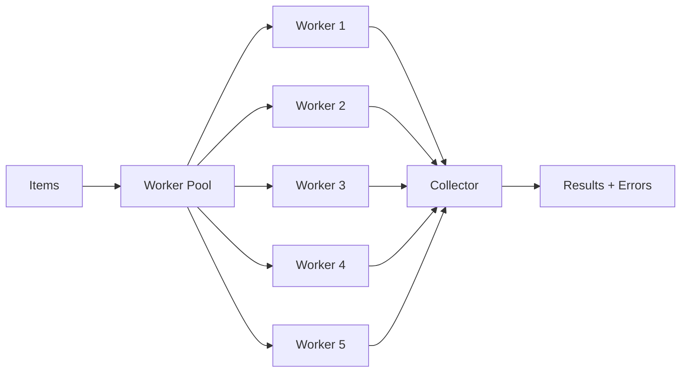

# Architecture

This document describes the internal architecture of Canvas CLI.

## Project Structure

```
canvas-cli/
├── cmd/canvas/           # Application entry point
├── commands/             # CLI command definitions (Cobra)
│   └── internal/
│       ├── options/     # Option structs for commands
│       ├── logging/     # Structured command logging
│       └── testing/     # Command test helpers
├── internal/
│   ├── api/             # Canvas API client and services
│   ├── auth/            # OAuth 2.0 + PKCE authentication
│   ├── config/          # Configuration management
│   ├── cache/           # Response caching
│   ├── batch/           # Concurrent batch operations
│   ├── diagnostics/     # canvas doctor checks
│   ├── dryrun/          # --dry-run curl rendering
│   ├── output/          # Output formatters
│   ├── progress/        # Progress indicators
│   ├── repl/            # Interactive shell
│   ├── shellparse/      # Shell-style argument parsing
│   ├── telemetry/       # Opt-in usage telemetry
│   ├── terminal/        # Terminal capabilities
│   ├── update/          # Self-update checks
│   └── webhook/         # Webhook listener
├── testdata/spec/       # Committed Canvas API spec manifest
├── tools/               # Code generators (docs, spec sync)
├── docs/                # Documentation
└── test/                # Test fixtures and integration tests
```

## Component Overview



## Core Components

### API Client

The API client (`internal/api/`) provides a type-safe interface to the Canvas
REST API. Each Canvas resource has its own service struct wrapping the shared
client — ~95 services covering 80% of Canvas's documented endpoints.



**Key features:**
- Automatic pagination handling
- Rate limit awareness
- Exponential backoff retry
- Request/response logging

### Authentication

OAuth 2.0 with PKCE (Proof Key for Code Exchange) for secure authentication.



**Token storage priority:**
1. System keyring (macOS Keychain, Windows Credential Manager, Linux Secret Service)
2. Encrypted file fallback (AES-256-GCM)

### Rate Limiting

Adaptive rate limiting respects Canvas API quotas.



### Caching

Smart caching with TTL-based invalidation:

| Resource | TTL |
|----------|-----|
| Courses | 15 minutes |
| Users | 5 minutes |
| Assignments | 10 minutes |
| Modules | 10 minutes |

### Batch Processing

Concurrent processing with configurable parallelism:



## Technology Stack

| Component | Technology |
|-----------|------------|
| Language | Go 1.25+ |
| CLI Framework | [Cobra](https://github.com/spf13/cobra) |
| Configuration | [Viper](https://github.com/spf13/viper) |
| OAuth | golang.org/x/oauth2 |
| Rate Limiting | golang.org/x/time/rate |
| Keyring | zalando/go-keyring |
| Logging | log/slog (stdlib) |

## Design Principles

1. **Security First** - All credentials encrypted, no hardcoded secrets
2. **Graceful Degradation** - Fallbacks for keyring, network, and API issues
3. **User Experience** - Progress indicators, helpful error messages
4. **Testability** - Interface-driven design, mock-friendly
5. **Performance** - Caching, batching, concurrent operations

## Error Handling

Custom error types with actionable suggestions:

```go
type CanvasError struct {
    StatusCode int
    Message    string
    Suggestion string
    DocURL     string
}
```

## Spec Compliance

Every `/api/v1/...` path the service layer calls is validated against Canvas's
official API spec (Swagger 1.2), committed under `testdata/spec/`. A
network-free contract test (`internal/api/spec_contract_test.go`) harvests the
called paths and fails the build on any endpoint Canvas doesn't document.
`make spec-sync` refreshes the manifest from a live Canvas host and
`make spec-coverage` reports the unimplemented gap. See
[API Coverage](api-coverage.md) for details.

## Testing Strategy

- Unit tests for all services
- Integration tests with mock HTTP server
- Total coverage gate of ≥80% enforced in CI
- Race condition detection enabled
- Spec contract test guards endpoint paths
